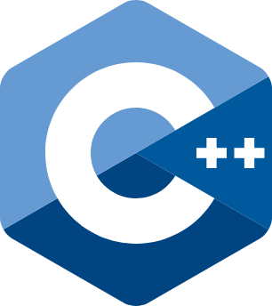

    

 

 
 

 
 

# _Learn C++_

> All you need is C++ and you can read that here.

This repository contains a collection of C++ code samples on various topics. Here you will find examples of basic to advanced C++ concepts.

## Structure

- `basics/` - Basic C++ examples
- `data_structures/` - data structures (arrays, lists, maps, etc.)
- `oop/` - Object-oriented programming
- `algorithms/` - Algorithms (sorting, searching, etc.)
- `advanced/` - Advanced topics (multithreading, pointers, etc.)

## Join in

1. Fork the repository
2. Create a branch
3. Add your code example
4. Create a pull request

## License

This project is licensed under the [MIT License](LICENSE).